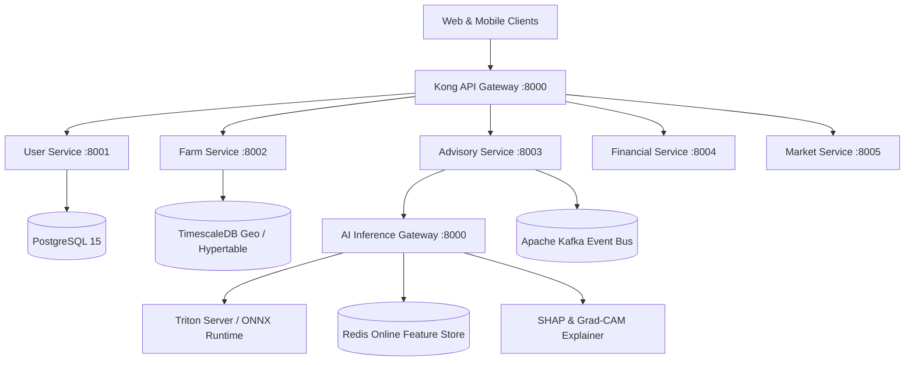

# AgriDecision AI Platform - Comprehensive System Documentation

## 1. System Architecture Diagram

---

## 2. Component Specifications

### 2.1 AI Platform & Inference Gateway
- **Triton Server & Local ONNX Runtime**: High-throughput asynchronous client serving `crop_recommendation` (Scikit-Learn), `yield_prediction` (XGBoost), `price_forecasting` (LSTM), and `disease_detection` (ResNet50).
- **Explainable AI**: SHAP TreeExplainer/KernelExplainer for feature importance attribution; PyTorch Grad-CAM for plant disease computer vision heatmap visualization.
- **Model Registry & Monitoring**: Version control database registering model metrics (accuracy, RMSE, F1) with KS-Test and PSI telemetry drift detection.

### 2.2 Microservices Architecture
1. **User Service**: Identity & Access Management (IAM), OAuth2 (Google/Apple), asymmetric RSA JWT tokens, and RBAC (FARMER, AGRONOMIST, ADMIN, ENTERPRISE).
2. **Farm Service**: PostGIS spatial boundary polygons, soil profiles, crop seasons, and IoT sensor device telemetry.
3. **Advisory Service**: Irrigation scheduling engines, automated crop recommendations, and leaf disease diagnostic workflows.
4. **Financial Service**: AI-based microloan credit scoring (0-900), risk profiling, and repayment management.
5. **Market Service**: Real-time mandi rates, trend forecasting, and corporate off-take contract matching.

### 2.3 Frontend & Mobile User Experience
- **React Web Portal**: Built with React 18, Vite, Material UI (MUI v5), TypeScript, dark mode theme system, role-based route guards, and live REST API integration.
- **Flutter Mobile App**: Cross-platform Android/iOS app with camera scan integration, GPS plot boundary recording, voice assistant, offline SQLite database (`sqflite`), and background synchronization queue.

---

## 3. Security & Deployment

- **OWASP Hardening**: Strict Content Security Policy (CSP), HTTP Strict Transport Security (HSTS), X-Frame-Options DENY, X-Content-Type-Options nosniff, and rate-limiting middleware.
- **DevOps & Infrastructure**: Multi-stage Docker composition, Kubernetes Helm charts, ArgoCD gitops manifests, Terraform IaC, and Prometheus/Grafana monitoring dashboard provisioning.
