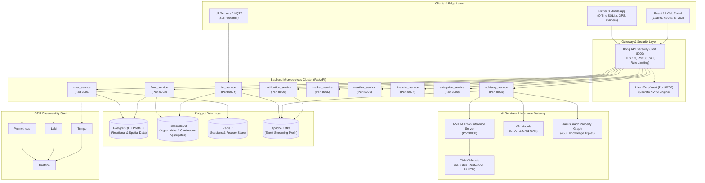
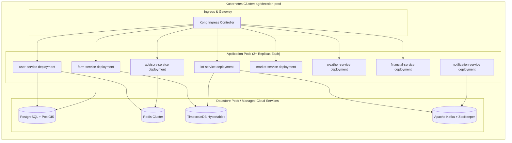
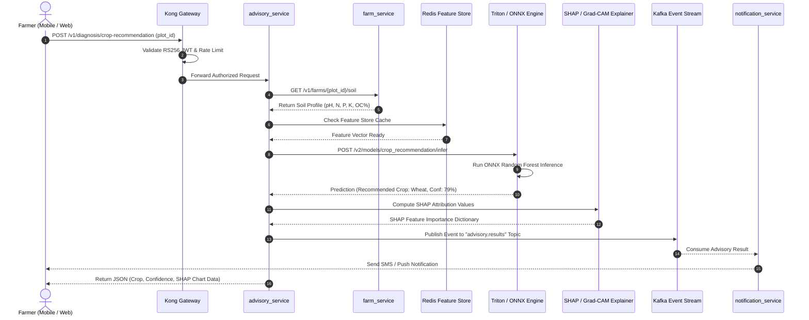

# Architecture Diagrams
## AgriDecision AI — System Architecture & Data Flow Visualizations
**Document Version:** 1.0 | **Date:** July 28, 2026

---

## 1. High-Level System Architecture Diagram

---

## 2. Microservice Container & Network Topology Diagram

---

## 3. End-to-End AI Advisory Data Flow Diagram

