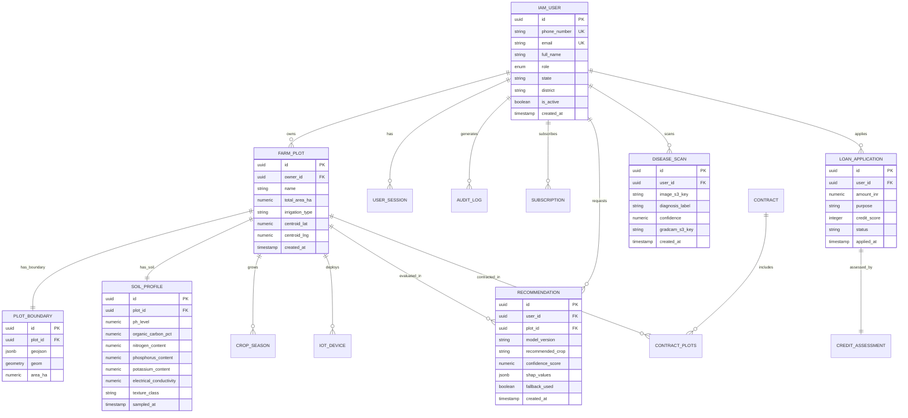
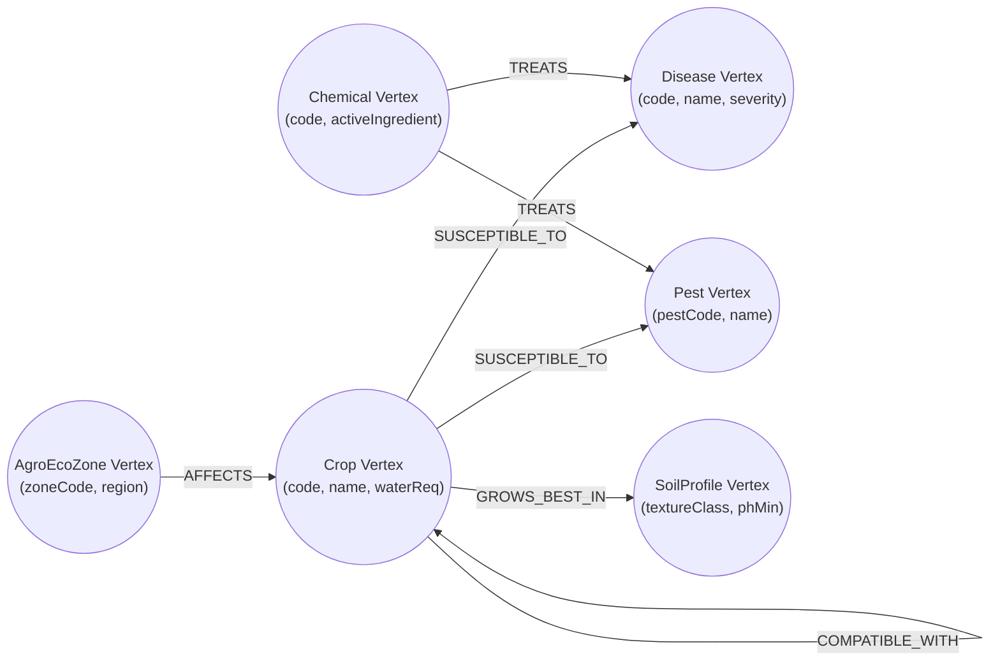

# Entity-Relationship (ER) Diagram
## AgriDecision AI — Relational Schema & Property Graph Data Model
**Document Version:** 1.0 | **Date:** July 28, 2026

---

## 1. Relational Database ER Diagram (PostgreSQL)

---

## 2. JanusGraph Knowledge Graph Schema Diagram

