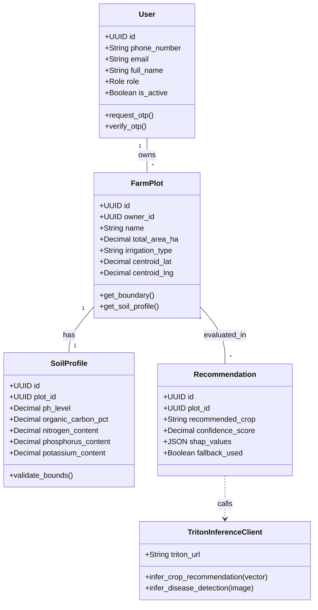
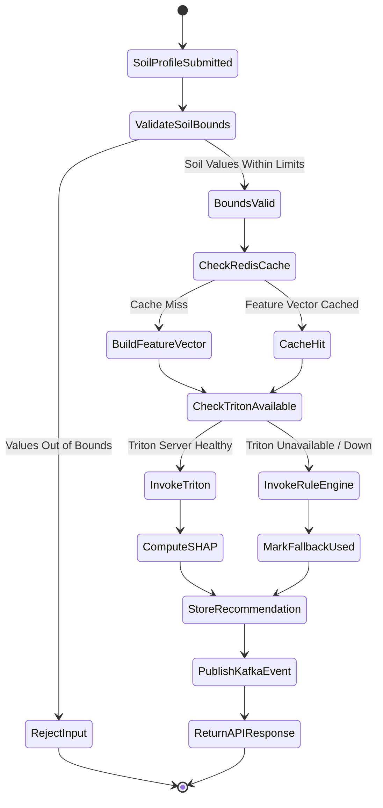
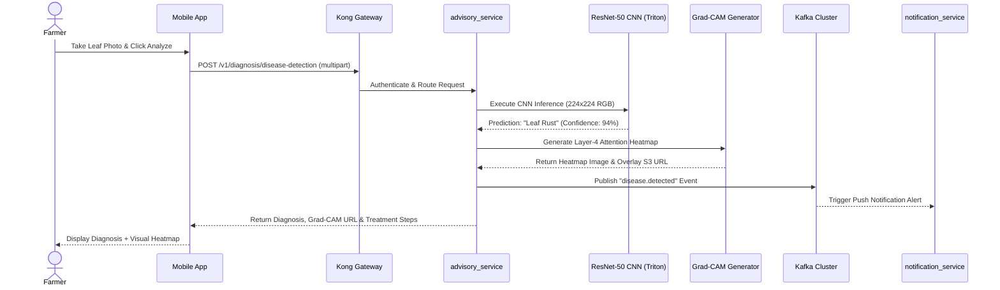
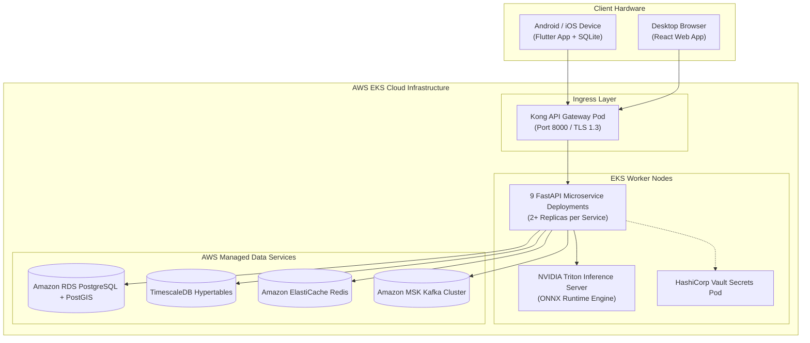

# Unified Modeling Language (UML) Diagrams
## AgriDecision AI — Complete System Design Visualizations
**Document Version:** 1.0 | **Date:** July 28, 2026

---

## 1. Use Case Diagram

```mermaid
graph TD
    Farmer((Farmer))
    Agronomist((Certified Agronomist))
    Enterprise((Enterprise User))
    Admin((Platform Admin))

    subgraph AgriDecision_AI_System["AgriDecision AI System Boundary"]
        UC1[UC-1: Register & Verify via OTP]
        UC2[UC-2: Draw Farm Plot Boundary]
        UC3[UC-3: Upload Soil Test Profile]
        UC4[UC-4: Request AI Crop Recommendation]
        UC5[UC-5: Capture Leaf Image & Detect Disease]
        UC6[UC-6: View 7-Day Weather & ET₀ Forecast]
        UC7[UC-7: Check Mandi Prices & Forecasts]
        UC8[UC-8: Apply for Agri Credit & Loans]
        UC9[UC-9: Review & Annotate AI Recommendations]
        UC10[UC-10: Issue Custom Agronomic Advisory]
        UC11[UC-11: Create Procurement Contract]
        UC12[UC-12: Trace Supply Chain Origins]
        UC13[UC-13: Manage User Roles & Permissions]
        UC14[UC-14: Monitor System Telemetry & Model Drift]
        UC15[UC-15: Trigger GDPR Data Export / Deletion]
    end

    Farmer --> UC1
    Farmer --> UC2
    Farmer --> UC3
    Farmer --> UC4
    Farmer --> UC5
    Farmer --> UC6
    Farmer --> UC7
    Farmer --> UC8

    Agronomist --> UC1
    Agronomist --> UC4
    Agronomist --> UC5
    Agronomist --> UC9
    Agronomist --> UC10

    Enterprise --> UC1
    Enterprise --> UC11
    Enterprise --> UC12

    Admin --> UC13
    Admin --> UC14
    Admin --> UC15
```

---

## 2. Class Diagram (Backend Core Domain)

---

## 3. Activity Diagram (Crop Recommendation Flow)

---

## 4. Sequence Diagram (Disease Detection & Advisory Flow)

---

## 5. Deployment Diagram

